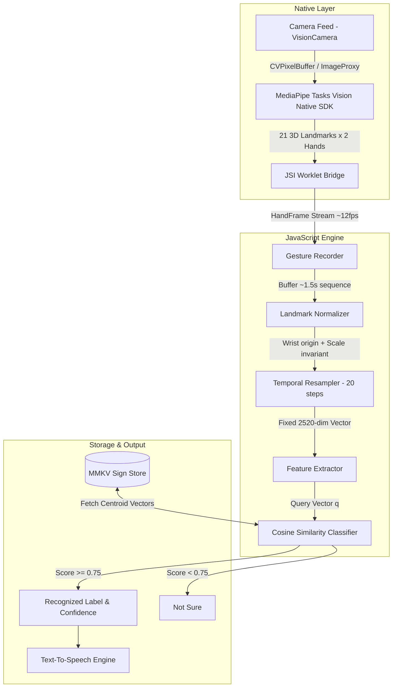

# ⚡ SIGNAL

<div align="center">


**Personalized, 100% On-Device AI Sign Language Recognition & Vocalization Engine**

[](https://reactnative.dev/)
[](https://www.typescriptlang.org/)
[](https://developers.google.com/mediapipe)
[](https://github.com/safwanshk11/signal)
[](https://github.com/mrousavy/react-native-mmkv)
[](https://jestjs.io/)

---

[Overview](#-overview--mission) •
[Key Features](#-key-features) •
[Architecture](#-architecture) •
[ML Pipeline & Math](#-machine-learning-pipeline--mathematics) •
[Design System](#-design-system--feelings-system) •
[Setup Guide](#-setup--installation) •
[Verification](#-testing--verification) •
[Roadmap](#-roadmap)

---

</div>

## 📌 Overview & Mission

Traditional sign language recognition models force users to conform to standard pre-trained vocabularies (e.g., ASL or BSL). For non-verbal individuals, deaf communities, or families with custom home signs and unique physical accessibility needs, standard pre-trained datasets often fall short.

**SIGNAL reverses the paradigm.**

Instead of requiring users to learn pre-packaged gesture datasets, **SIGNAL allows anyone to teach their phone their own custom signs from just 5 recorded examples**. It extracts 3D hand landmarks in real time and classifies personalized gestures using high-speed, on-device spatial-temporal vector similarity.

### 🛡️ Core Principles

1. **100% On-Device & Offline**: Camera feeds are processed locally in real time. Video frames and raw camera images **never** leave the device or get written to disk.
2. **Zero Cloud / Zero AI APIs**: No subscriptions, no cloud latency, no telemetry, and no external LLM dependencies.
3. **Few-Shot Learning**: Learn a new gesture from just **5 recordings** using centroid cosine similarity.
4. **Privacy-Preserving Storage**: Only normalized 3D coordinate matrices (21 landmarks $\times$ 3 axes) are saved locally via MMKV.

---

## ✨ Key Features

- 🖐 **Real-Time Native Landmark Extraction**: Uses MediaPipe Tasks Vision native SDKs (Kotlin on Android, Swift on iOS) integrated via `react-native-vision-camera` frame processors for ultra-low overhead (~60 FPS).
- 📐 **Few-Shot Gesture Learning**: Perform a sign 5 times to generate a robust 2520-dimensional feature centroid for instant recognition.
- 🎯 **Confidence Thresholding & Ambiguity Rejection**: Strict similarity gating ($0.75+$ threshold) prevents false positives, cleanly reporting *"Not Sure"* when a gesture matches nothing registered.
- ⚡ **Microsecond Storage**: Powered by `react-native-mmkv` for instantaneous local persistence of custom signs, stats, and practice history across app restarts.
- 🗣 **Offline Vocalization**: Text-to-speech integration (`react-native-tts`) immediately pronounces recognized sign labels aloud.
- 📊 **Real-Time Performance Dashboard**: Integrated telemetry tracking landmark frame rates, feature vector assembly time, and classification latency down to sub-millisecond precision.
- 🎓 **Interactive Quiz Mode**: Built-in practice suite to test your memory and gesture recall against your personal dictionary.
- 🎨 **Tactile "Feelings System" UI**: High-contrast, brutalist aesthetic featuring hard 8px offset shadows, custom typography (`Archivo`, `Archivo Expanded`, `IBM Plex Mono`), vibrant lime/coral accents, and responsive micro-animations.

---

## 🏗 Architecture

SIGNAL combines native C++/Kotlin/Swift frame processing with a high-performance, pure-TypeScript ML pipeline running off the main thread via JSI worklets.



### 📁 Repository Structure

```
SIGNAL/
├── android/                             # Android native project & Gradle build
│   └── app/src/main/
│       ├── assets/
│       │   ├── fonts/                   # Custom Archivo & IBM Plex Mono TTF fonts
│       │   └── hand_landmarker.task     # MediaPipe HandLandmarker model bundle (~7.8MB)
│       └── java/com/signalapp/
│           └── frameprocessors/
│               └── HandLandmarkerFrameProcessorPlugin.kt   # Native Kotlin MediaPipe Frame Processor
├── ios/                                 # iOS native project & CocoaPods setup
│   └── SignalApp/
│       ├── Fonts/                       # Bundled static TTF font assets
│       ├── Resources/hand_landmarker.task
│       └── FrameProcessors/
│           ├── HandLandmarkerFrameProcessorPlugin.swift   # Native Swift MediaPipe Frame Processor
│           └── HandLandmarkerFrameProcessorPlugin.m       # Objective-C JSI export header
├── src/
│   ├── camera/                          # Camera feed & frame processor bindings
│   │   ├── LandmarkCamera.tsx           # VisionCamera wrapper component
│   │   ├── gestureRecorder.ts           # ~1.5s multi-frame gesture buffer
│   │   └── handLandmarkerPlugin.ts      # JS interface for native frame processor
│   ├── components/                      # TinyWins Feelings System design components
│   │   ├── Button.tsx                   # Tactile hard-shadow buttons
│   │   ├── FlipCameraButton.tsx         # Camera direction toggle
│   │   ├── HandSkeleton.tsx             # Real-time 2D landmark overlay renderer
│   │   ├── HardShadow.tsx               # 8px offset brutalist border box wrapper
│   │   ├── Marquee.tsx                  # Dynamic ticker banner
│   │   ├── ProgressBar.tsx              # Practice & recording progress tracker
│   │   ├── Reveal.tsx                   # Animated entry wrapper
│   │   ├── SplashScreen.tsx             # Brand launch experience
│   │   ├── StatBand.tsx                 # Real-time latency & FPS display
│   │   └── Tag.tsx                      # Meta tags & badge labels
│   ├── ml/                              # Pure TypeScript ML & Similarity Pipeline
│   │   ├── __tests__/
│   │   │   └── pipeline.test.ts         # Complete pipeline unit tests
│   │   ├── classifier.ts                # Nearest-centroid cosine classifier
│   │   ├── gestureFeatures.ts           # Matrix flattening to 2520-dim feature vector
│   │   ├── normalizeLandmarks.ts        # Wrist translation & palm-scale normalization
│   │   ├── similarity.ts                # Cosine similarity mathematical routines
│   │   ├── temporalResampler.ts         # Linear sequence resampling (20 fixed timesteps)
│   │   └── types.ts                     # Strict TypeScript interfaces
│   ├── navigation/                      # React Navigation stack configuration
│   ├── screens/                         # App screens
│   │   ├── AddSignScreen.tsx            # 5-step sign recording wizard
│   │   ├── AnalyticsScreen.tsx          # Real-time latency & ML instrumentation UI
│   │   ├── HomeScreen.tsx               # Dashboard & rapid action launchpad
│   │   ├── MySignsScreen.tsx            # Personal sign library manager
│   │   ├── OnboardingScreen.tsx         # User welcome & permission guide
│   │   ├── QuizScreen.tsx               # Interactive sign recall challenge
│   │   ├── RecognitionScreen.tsx        # Live camera sign recognition & speech output
│   │   └── SignDetailScreen.tsx         # Individual sign inspector & sample manager
│   ├── speech/                          # react-native-tts offline vocalizer wrapper
│   ├── storage/                         # MMKV repository abstractions
│   ├── theme/                           # TinyWins Feelings System design tokens
│   └── utils/                           # High-precision latency benchmark tools
├── App.tsx                              # Root Application entry point
├── package.json                         # Project manifests & dependencies
└── tsconfig.json                        # Strict TypeScript config
```

---

## 🧮 Machine Learning Pipeline & Mathematics

SIGNAL operates on **few-shot landmark similarity**. Rather than training heavy deep neural network weights per user on-device (which consumes battery and heat), SIGNAL converts temporal gesture sequences into scale-and-position-invariant spatial vectors.

### 1. Spatial Normalization

For each frame $t$, MediaPipe extracts $K = 21$ 3D points $\vec{p}_i = (x_i, y_i, z_i)$ per detected hand (up to 2 hands: Left & Right).

$$\text{Wrist Origin Alignment: } \vec{p'}_i = \vec{p}_i - \vec{p}_{\text{wrist}}$$

To ensure scale invariance regardless of hand distance from the camera:

$$\text{Palm Scale Factor: } s = \|\vec{p}_{\text{middle\_mcp}} - \vec{p}_{\text{wrist}}\|$$

$$\text{Normalized Landmark: } \hat{p}_i = \frac{\vec{p'}_i}{s}$$

### 2. Temporal Resampling

Gestures naturally vary in execution speed. A recorded performance might span 12 frames or 25 frames over the ~1.5s window.

SIGNAL applies **linear sequence resampling** to normalize every recorded gesture sequence $S = [f_1, f_2, \dots, f_M]$ to exactly $T = 20$ fixed temporal timesteps:

$$t_k = 1 + (k - 1) \cdot \frac{M - 1}{T - 1}, \quad k \in \{1, \dots, 20\}$$

Interpolating coordinates across fractional frame indices ensures exact temporal alignment across arbitrary gesture speeds.

### 3. Feature Flattening

Every normalized, resampled gesture is flattened into a single 1D feature vector $\vec{f} \in \mathbb{R}^{D}$:

$$D = T \,(20) \times H \,(2 \text{ hands}) \times K \,(21 \text{ landmarks}) \times C \,(3 \text{ coords}) = 2520 \text{ dimensions}$$

### 4. Centroid Vector & Cosine Classification

When a user records $N = 5$ samples for a sign $S$, SIGNAL computes the sign centroid $\vec{c}_S$:

$$\vec{c}_S = \frac{1}{N} \sum_{n=1}^{N} \vec{f}_n$$

During live recognition, a query gesture vector $\vec{q}$ is compared against all saved sign centroids via **Cosine Similarity**:

$$\text{Sim}(\vec{q}, \vec{c}_S) = \frac{\vec{q} \cdot \vec{c}_S}{\|\vec{q}\| \|\vec{c}_S\|} = \frac{\sum_{i=1}^{D} q_i \, c_{S, i}}{\sqrt{\sum_{i=1}^{D} q_i^2} \sqrt{\sum_{i=1}^{D} c_{S, i}^2}}$$

### 5. Gating & Rejection

$$\text{Prediction} = \begin{cases} \arg\max_{S} \text{Sim}(\vec{q}, \vec{c}_S) & \text{if } \max_S \text{Sim}(\vec{q}, \vec{c}_S) \ge \theta \\ \text{null ("Not Sure")} & \text{otherwise} \end{cases}$$

Where $\theta = 0.75$ is the empirical confidence threshold.

---

## 🎨 Design System: "Feelings System"

SIGNAL's user interface is crafted using the **TinyWins "Feelings System"** design tokens:

- **Typography**: 
  - Display Headers: `Archivo` & `Archivo Expanded` (`wdth 125`, `wght 700–800`) cut locally from variable fonts.
  - Metadata & Monospace: `IBM Plex Mono` for raw metrics, counters, and technical tags.
- **Palette**:
  - Ink & Paper Neutrals (`#121212`, `#F7F5F0`, `#E8E4D9`)
  - Lime Spark Accent (`#CCFF00`)
  - Coral Signal Accent (`#FF4500`)
- **Brutalist Tactile Geometry**:
  - Hard square corners (`borderRadius: 0` or crisp 4px)
  - Hard 8px offset shadows (`#121212`)
  - High contrast 2px borders

---

## 💻 Setup & Installation

### Prerequisites

- Node.js $\ge 18$
- macOS (for iOS builds) or Android Studio (for Android builds)
- CocoaPods (`gem install cocoapods`)
- JDK 17+ & Android SDK 34+

### 1. Clone & Install Dependencies

```bash
git clone https://github.com/safwanshk11/signal.git
cd SIGNAL
npm install
```

### 2. Android Build

The required bundled MediaPipe vision model `hand_landmarker.task` (~7.8MB) is pre-packaged in `android/app/src/main/assets/`.

```bash
npx react-native run-android
```

### 3. iOS Build

```bash
cd ios
bundle install
bundle exec pod install
cd ..
npx react-native run-ios
```

> **Note for Xcode**: Ensure `ios/SignalApp/Resources/hand_landmarker.task` is added to your target's **Copy Bundle Resources** phase and `HandLandmarkerFrameProcessorPlugin.swift` is included under **Compile Sources**.

---

## 🧪 Testing & Verification

SIGNAL includes a pure-TypeScript unit test suite verifying landmark translation, temporal sequence resampling, feature vector dimensionality, 3-way gesture discrimination, and ambiguity rejection.

Run the test suite:

```bash
npm test
```

### Test Suite Output

```text
PASS src/ml/__tests__/pipeline.test.ts
  SIGNAL personalized gesture pipeline
    ✓ extracts a fixed-length feature vector regardless of recorded frame count (5 ms)
    ✓ registers three distinct signs and recognizes each correctly with high confidence (67 ms)
    ✓ reports "not sure" (null) for a gesture that matches nothing registered (8 ms)

Test Suites: 1 passed, 1 total
Tests:       3 passed, 3 total
Snapshots:   0 total
Time:        0.36 s
```

---

## 🔒 Permissions & Privacy Security

SIGNAL is engineered ground-up for complete user data sovereignty:

| Platform | Permission Requested | Purpose |
|---|---|---|
| **iOS** | `NSCameraUsageDescription` | Real-time hand landmark extraction. Video frames are processed in-memory and immediately released. |
| **Android** | `android.permission.CAMERA` | Camera frame stream for MediaPipe native frame processor. |

- ❌ **No Location Data**: Zero GPS / cell tower tracking.
- ❌ **No Microphone Access**: Speech is output-only via local TTS.
- ❌ **No Network / Cloud Calls**: Recognition, storage, and audio vocalization operate 100% offline.

---

## 🗺️ Roadmap

- [x] **Phase 0 (Current)**: On-device MediaPipe 3D landmark extraction, 5-shot centroid similarity learning, MMKV storage, offline TTS, practice quiz, and Feelings System UI.
- [ ] **Phase 1**: Automatic gesture onset/offset detection (eliminating the manual recognition hold window).
- [ ] **Phase 2**: On-device fine-tuning via `react-native-fast-tflite` for complex dynamic trajectories.
- [ ] **Phase 3**: Continuous multi-sign sentence assembly & real-time conversational streaming mode.

---

<div align="center">

**Built with ❤️ for accessible, private, and personalized communication.**

</div>
